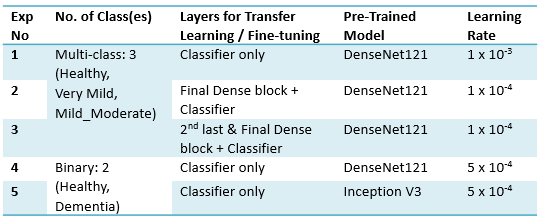

## Dataset Organisation

The codes and excel sheets that are used for organising of the dataset can be found in the "Data Pre-Organisation Folder".
- The original dataset was downloaded from OASIS Alzheimer's dataset on Kaggle [(Link)](https://www.kaggle.com/datasets/ninadaithal/imagesoasis). It is not included in this repo as it is very large.
- The code that was used to organise the dataset is found in "organise_train_test_split.ipynb".
- "patient_list.xlsx" contains a list of patients and their label (diagnosis severity)
- "curated_file_list_full.xlsx" contains the last of filepaths for all images in  the dataset, after being assigned to the train/validation/test set
- "curated_file_list_short.xlsx" is a subset of the full list, containing only the MPR-1 images. This is the final list of filepaths that we are using in our dataset.
- The curated dataset that we used for training is found in "OASIS_dataset_organised_short.zip"

## Experiments

The notebooks where the ML models are run are in the following files. These correspond with each experiment as described in the report / image below.
- BT5151_Experiment_1.ipynb
- BT5151_Experiment_2.ipynb
- BT5151_Experiment_3.ipynb
- BT5151_Experiment_4.ipynb
- BT5151_Experiment_5.ipynb

